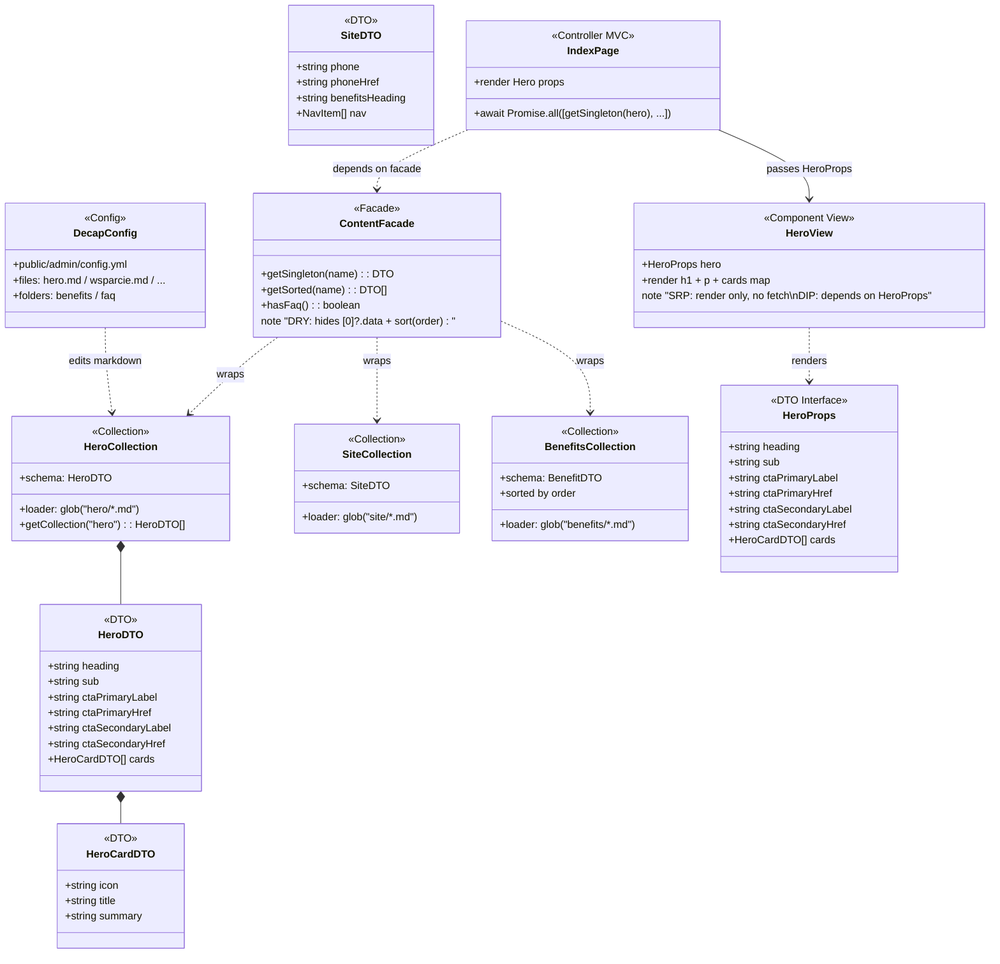
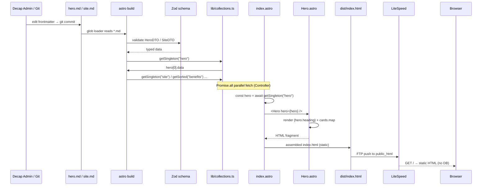
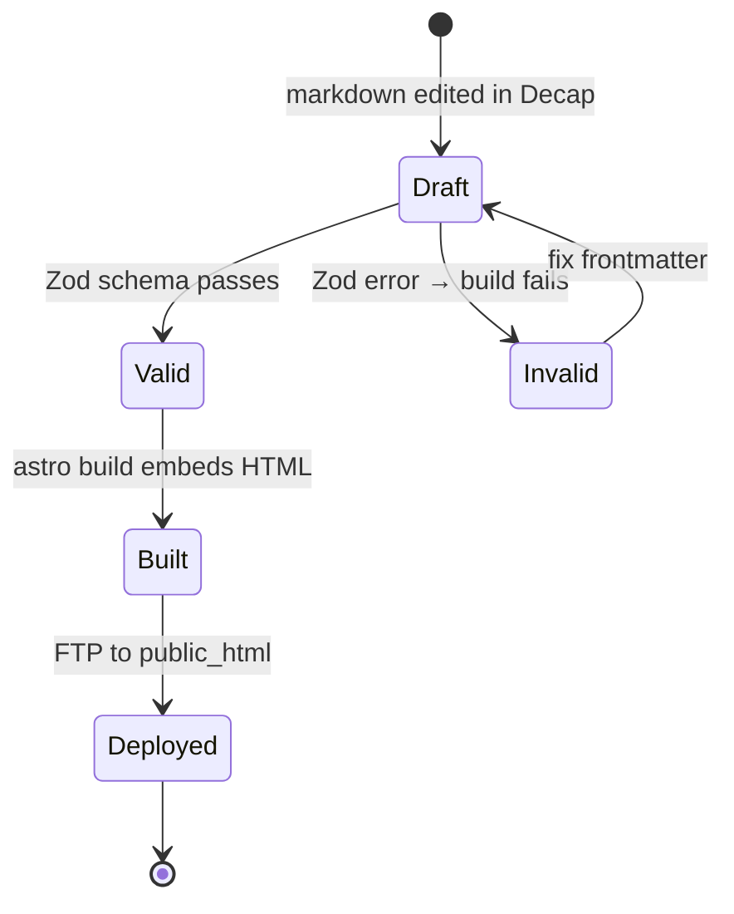

# Content Architecture — Hero & Singleton Collections

> Scope: `site/src/content/**` (10 collections) + `site/src/lib/collections.ts` facade + `site/src/pages/index.astro` orchestrator + `site/src/components/sections/Hero.astro` view.
> Follows §1 Evaluate → §2 Diagram (software-design-excellence). See pattern table below + UML legends.

## §1 Evaluate — Pattern & Principle Selection

| Candidate | Verdict | Why |
|---|---|---|
| **Repository (interface + impl)** | rejected | YAGNI — single source (markdown via `astro:content`), no swapping, no test double needed today. Astro's `getCollection` already is repository. |
| **Facade (`lib/collections.ts`)** | **adopted** | DRY — hides `[0]?.data` + `sort(order)` repetition across 7 singletons + 3 lists. Minimal wrapper, KISS, centralizes Zod typing. |
| **Factory Method / Abstract Factory** | rejected | Single creation path: `glob` + `z.object`. No varying families. Plain schema suffices. |
| **Builder** | rejected | YAGNI — cards built declaratively in YAML frontmatter, not programmatically. |
| **Adapter** | rejected | No incompatible interface to adapt; Zod schema matches Decap widget output 1:1. |
| **Decorator / Proxy / Cache** | rejected | Build-time only, no runtime cost. No cross-cutting concern to decorate. |
| **Composite** | rejected | `cards` is flat `HeroCard[]`, no leaf/composite hierarchy. |
| **Strategy** | rejected | One rendering strategy per section. No interchangeable algorithm. |
| **Template Method** | rejected | Sections shapes differ (Hero=cards+CTAs, Wsparcie=tiers, Omnie=bio list). No common skeleton to template; composition preferred. |
| **Observer / State / Command** | rejected | Static site, no lifecycle or event flow. |
| **Layers (PoSA)** | **adopted** | `Markdown → Zod Collection → Facade → Page → View` — boundaries explicit, testable, static-first. |
| **MVC** | **adopted** | `index.astro` = Controller (fetches via facade), `sections/*.astro` = View (props in). Thin controller, dumb view. |
| **Component-Based** | **adopted** | Each section is isolated `*.astro` component, composes via `index.astro`. |
| **Microservices / Broker / CQRS** | rejected | Single landing page, tiny traffic, cost-free. Would violate KISS/YAGNI. |

**Principles:**
- **SRP** — Page fetches, View renders. Hero.astro must not call `getCollection` itself (two reasons to change). Fix: props injection.
- **DIP** — View depends on `HeroProps` interface (abstraction), not on `astro:content` (detail). Facade is the abstraction boundary.
- **DRY** — extracted after 3rd duplication `[0]?.data` (hero×7). Rule of Three satisfied.
- **LoD** — View touches `hero` + `hero.cards[]` one level deep only; no `a.getB().getC()` chain. Guard `hero` via required prop.
- **YAGNI/KISS** — ties broken toward no pattern. No `Repository` interface, no `AbstractSectionFactory`.

## §2 Diagrams

### classDiagram — Content domain + Facade + View

### sequenceDiagram — Build-time content flow (static, no runtime DB)

### stateDiagram — Content entry lifecycle

**Notes / legends applied:**
- SRP: `HeroView` has one reason to change (layout), not fetching.
- DIP: `HeroView` → `HeroProps` (interface), not `astro:content`.
- DRY: Facade extracts 7× `[0]?.data` + 3× `sort(order)` (Rule of Three).
- LoD: view accesses `hero` then `hero.cards` only; no `getCollection().data.cards[0].title` chain.
- YAGNI: Repository interface, Decorator, Strategy rejected — KISS wins.
